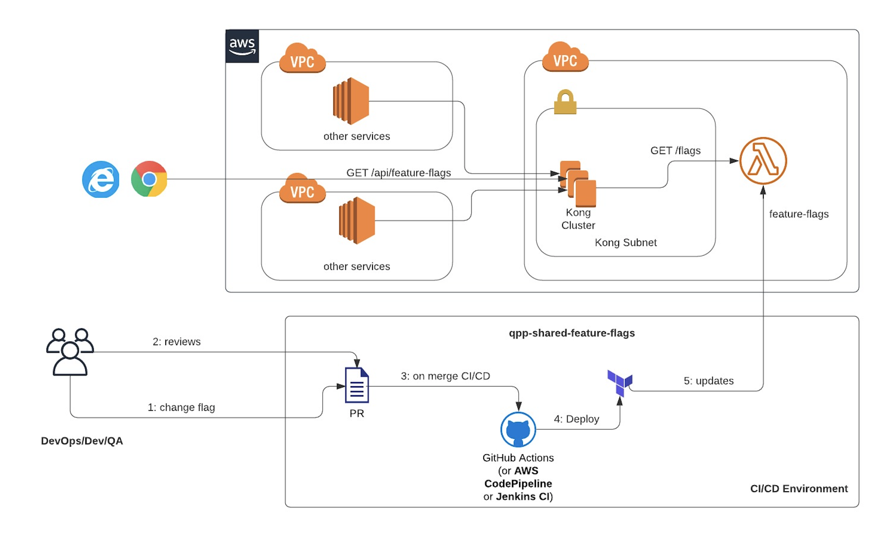

# Welcome 

## Feature Flag

martinfowler.com:
> Feature Toggles (often also refered to as Feature Flags) are a powerful technique, 
> allowing teams to modify system behavior without changing code.

John King: 
> Feature Flags allow teams to deploy to Production frequently, without (_outwardly_) changing application behavior. 
> Feature flag values can later be changed, as part of a release process, causing new behavior to take effect. 
> In other words, it separates **Deployments** from **Releases**.

_**Thumb Rule** - :+1: the ones you do not anticipate `QAs'` toggle in `IMP`, are not qualified as `feature flags`._ 
Mostly such flags are system configuration variables (a.k. environment variables).

## Responsibilities
- **Developers:** You are responsible for adding and removing flags and modify the code base(s).
- **QA Engineers:** You are allowed for changing the feature flags on lower tiers such as `DEV` or `IMP` for testing purposes.
- **Release Engineers:** You are responsible for the accuracy of the flag values on PROD environment.

## Anatomy Of Feature Flag
``` 
   { 
    "name": "use_tealium",
    "value": true,
    "type": "boolean",
    "tags": ["FE","SF", "TR", "SN"],
    "description": "Will enable/disable the use of Tealium in UI apps"
  }
```
- name - represent the `name` of the feature flag.
- value - the `value` associated the feature flag.
- type - the datatype of `value`, which can be used for validating the feature flag.
- tags - can be used to organize or even filter feature flags. In the example above, we use it to identify the teams/apps using that flag.
- description - a short human-readable text that explains the intention of the feature flag. 

```
  {
    "name": "DATA_SUBMISSION_WINDOW",
    "value": {
      "start": "2020-07-20T10:04:00",
      "end": "2020-07-22T10:06:00"
    },
    "type": "date-range",
    "tags": ["SUB"],
    "description": "Specifies the time frame during with data submission is allowed."
  }
```
Above is an example of a `timed` feature flag, whose `value` will evaluate to `true` during the date range specified in `start` and `end`.  
Assuming today is `2020-07-20`, the flag will evaluate to "true", the runtime evaluated value will be as shown below:
``` 
{
    "name": "DATA_SUBMISSION_WINDOW", 
    "value": true, 
    "range": { "start": "2020-07-20T10:04:00", "end": "2020-07-22T10:06:00" }
}
```

### Types Of Feature Flags

| Data Type | Meaning | Feature Flag (Data) | Flag Value (Runtime) |
|-|-|-|-|
| string | A string value | `{"name": "x", "type": "string", "value": "a string"}` | `{"name": "x", "value": "a string"}` |
| number | A number value | `{"name": "x", "type": "number", "value": 5}` | `{"name": "x", "value":5}` |
| boolean | A boolean value | `{"name": "x", "type": "boolean", "value": false}` | `{"name": "x", "value":false}` |
| date | A date value | `{"name": "x", "type": "date", "value": "2020-01-01:T00:00:01"}` | `{"name": "x", "value":"2020-01-01:T00:00:00"}` |
| date-range | A date range | `{"name": "x", "type": "date-range", "value": {"start":"2020-01-01:T00:00:01", "end":"2020-05-30:T10:30:00"}}` | `{"name": "x", "value":false, "range": {"start":"2020-01-01:T00:00:01", "end":"2020-05-30:T10:30:00"}}` |
| array | A array of string, numbers or booleans | `{"name": "x", "type": "array", "value": ["red", "blue"]}` | `{"name": "x", "value": ["read", "yellow"]}` |
| object | Any valid JSON object | `{"name": "x", "type": "object", "value": {"port":8080, "ssl": true, "defaultSettings": {} }}` | `{"name": "x", "value": {"port":8080, "ssl": true} }` |

#### date-range 

**NOTE:** _For all dates/time values the timezone is implicitly eastern._ 

`date-range` can be used to express scenarios like:

- enable "X" until a specific date (_on the contrary, disable "X" on a specific date_)
    ```
      {
        "name": "AMENDMENTS_ACCEPTED",
        "value": {
          "end": "2020-07-22T10:06:00"
        },
        "type": "date-range",
        "tags": ["TR"],
        "description": "Specifies the time frame during with data ammendments are allowed."
      }
      // Assuming today is 2020-04-29, this will evaluate to 
      {"name": "AMENDMENTS_ACCEPTED", "value" : true, range: {"end": "2020-07-22T10:06:00"}} 
  
      // Assuming today is 2020-08-01, this will evaluate to 
      {"name": "AMENDMENTS_ACCEPTED", "value" : false, range: {"end": "2020-07-22T10:06:00"}}         
    ```
- enable "X" after a specific date (_on the contrary, disable "X" before a specific date_)
    ```
      {
        "name": "MVP_ENABLED",
        "value": {
          "start": "2022-01-02T10:30:00"
        },
        "type": "date-range",
        "tags": ["SUB"],
        "description": "Specifies the date on which MVP are accepted."
      }
      // Assuming today is 2022-01-02T09:55:00, this will evaluate to 
      {"name": "MVP_ENABLED", "value" : false, range: {"start": "2022-01-02T10:30:00"}} 
  
      // Assuming today is 2022-01-02T11:55:00, this will evaluate to 
      {"name": "MVP_ENABLED", "value" : true, range: {"start": "2022-01-02T10:30:00"}} 
      
    ```

## Best Practices
 
- Do not store sensitive values in feature flags. 
- Do not store system configurations in feature flags.
- Maintain consistency across feature flags in all environments.
- Retire feature flags associated with features that are fully released to all environments.
- Avoid obfuscation, prefer flag names that easily convey the intended feature getting toggled.  

_Examples: (poor choices)_
``` 
BSR_ENABLE_RDS_SSL - this is a system configuration.
OAUTH_ENABLED - this is a system configuration that is `environment` specific.  
NEW_RELIC_LICENSE_KEY - this is bit of a sentivite value, again a environment specific system configuration.
feature_login - a fully implemented feature, a good candidate for retirement (a.k.a "hardcoding" in downstream application)
REJECT_XML - similar to above, a fully deprecated business functionality. 
enableNpiLogin - obfuscated!, actually used to hide "cost" category. 
```

## Tabular View
For a tabular view of the existing feature flags [refer flags.tsv](generated/flags.tsv) 

# Technical Approach

During the Feature Flag enabler discussion, we have come up with various options. 
The reference implementation is biased based on two of the low hanging options:

- Flag File in a Shared GitHub Repository
- Shared Feature Flag Service 

If we think through a bit, "feature flags" are a bunch of key value pairs. JSON is a popular format for storing key-value pairs, and everyone is familiar with it. 
OK! so, lets capture these features flags in JSON format. If we make those JSONs accessible/queryable via an HTTP API we have achieved what we needed. 
Serverless functions (AWS Lambda) is pretty popular these days, has very low maintenance and operational cost. 

Nowadays Github offers [inline editing](https://docs.github.com/en/github/managing-files-in-a-repository/editing-files-in-your-repository). 
The JSON feature flag files are pretty straight forward,is extremely easy for anyone to edit them and create a PR `on-the-fly` all using Github.com UI. 
The typical github branching and releasing process along with the capabilities offered by Github Actions can be leveraged to build, validate and deploy a AWS Lambda function with updated flage changes quickly.
  
[build.yml](.github/workflows/build.yml), a GitHub Action workflow is self describing, and uses teraform ([main.tf](terraform/main.tf)) to build and deploy a lambda function ([index.js](index.js)).  

The approach at a high-level is described in the diagram below. 



 -  [Kong AWS Lambda Routes](https://docs.konghq.com/hub/kong-inc/aws-lambda/) - has details on how to setup a Kong route. 
 -  [Terraform Lambda Snippets](https://www.terraform.io/docs/providers/aws/r/lambda_function.html) = has details about how to setup lambda functions using terraform. 
 -  [AWS Actions](https://github.com/marketplace/actions/configure-aws-credentials-action-for-github-actions) & [Terraform Actions](https://github.com/marketplace/actions/hashicorp-setup-terraform) - has documentation around deploying services in AWS using Github Actions.  

## Limitations & Mitigation Plan

**Throttling** - Literally AWS Lambda is highly scalable, default account specific concurrency limit is `1000 requests per second`. Kong API gateway, on the other hand has rate-limiting (_I believe about 60 request per minute from a specific IP_). So, literally the limitation is around Kong.
Outside of QA testing, the probability of these feature flags getting changed is rare. So, API clients (_**not UI clients**_) can cache these values for about 60 seconds. This can be controlled easily by providing a shared client (_like shared-logger_). Like APIs getting hit hard during scrapping, UI applications will not be throttling Kong. They do not even have worry about caching, but if need be, those apps can maintain values `session-storage` (or redux/ngrx stores) hence reduce API calls.

**Another Failure Point** - AWS Lambda outage is very rare, has`99.95%` uptime and moreover the feature-flag function do not even have other dependencies or complex logic in it. 
Anyway, every network client must be prepared for server failure, must ensure that `default values are not destructive` (_example `DATA_SUBMISSION_OPEN` flag if not available, must default to "`false`", which will not accept data from its clients_)
 
# Reference Implementation
Like depicted above, in order to publicly expose a Lambda function, we need an API gateway. Kong will ultimately be the API gateway that we will be using in PROD, but for the purposes of this POC, I will be using an existing AWS API Gateway configured outside of this deployment process. 

## Scenario: QA engineer wants to update a feature flag. 

1. QA engineer will go to say [dev.json](flags/dev.json), edits it via Github UI and commits to a branch. 
2. A PR is raised by QA engineer and automatically gets assigned to `codeowners`. 
3. Gihub Actions, workflow will run all quality checks, and appropriately mark the status in PR.  
4. The `codeowner` approves the PR and `squash merges` that PR into `master` branch. 
5. Github Actions workflow will deploy the updated lambda function code within a minute. 
6. Verify changes using https://35vitaoru1.execute-api.us-east-1.amazonaws.com/feature-flag

### Examples
 
| Request | Description |
|-|-|
| `https://35vitaoru1.execute-api.us-east-1.amazonaws.com/feature-flag?env=imp` | Returns all flags in tier IMP. |
| `https://35vitaoru1.execute-api.us-east-1.amazonaws.com/feature-flag?env=dev&tag=SF` | Returns all flags in DEV, associated with project SF. |
| `https://35vitaoru1.execute-api.us-east-1.amazonaws.com/feature-flag?env=dev&name=MVP_ENABLED` | Return the flag `MVP_ENABLED` in DEV. |
